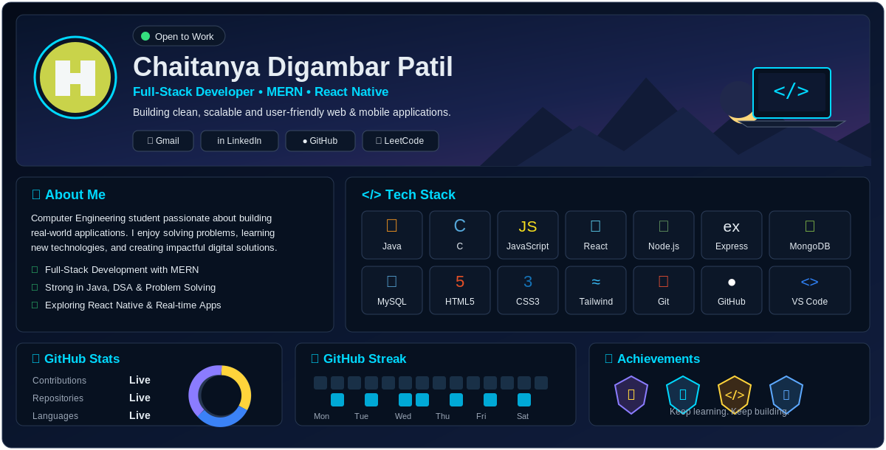

<!-- CUSTOM PROFILE IMAGE -->

  

<!-- GITHUB STATS -->

  

<!-- GITHUB STREAK -->

  

<!-- GITHUB TROPHIES -->

  

<!-- CONTRIBUTION GRAPH -->

  

<!-- FOOTER -->
### `CODE • LEARN • BUILD • REPEAT`

